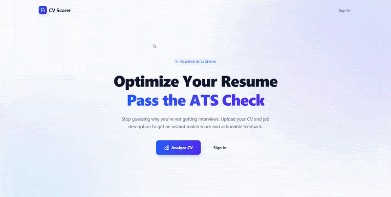
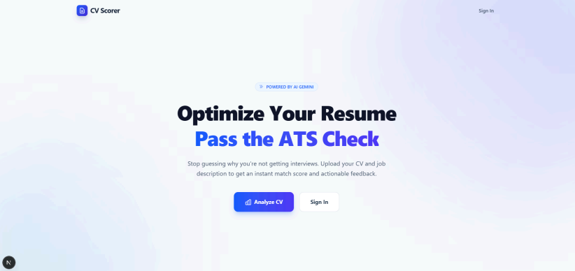
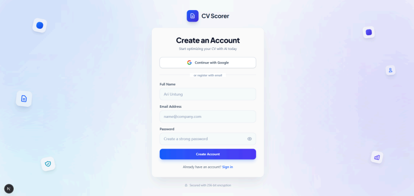
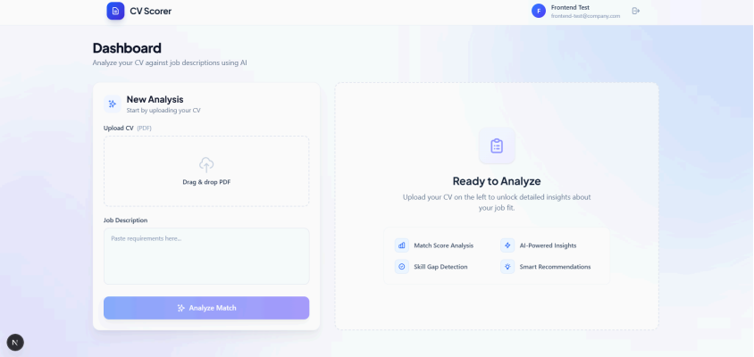

# JobFit AI - Frontend
An AI-powered resume analysis system built with Next.js, integrated with a FastAPI backend and Google Gemini AI.

**Website:** [https://tk-kowan-fe.vercel.app/](https://tk-kowan-fe.vercel.app/)

## Repository Links
- **Frontend:** https://github.com/komputasi-awan/tk-kowan-fe
- **Backend:** https://github.com/komputasi-awan/tk-kowan

## About the Project
JobFit AI helps job seekers optimize their resumes by analyzing their CV content against specific job descriptions using AI. The system provides a match score, a CV summary, and recommendations for skills that need improvement.

**Key Features:**
- **Authentication:** Firebase Authentication (Email/Password & Google OAuth).
- **CV Upload:** Secure PDF file uploads to AWS S3 (Private Bucket).
- **Secure Access:** Utilizes Presigned URLs for temporary file access.
- **PDF Parsing:** Automated text extraction from PDFs via AWS Lambda.
- **AI Analysis:** Google Gemini integration to match CVs against Job Descriptions.
- **Analysis Results:** Displays match scores, CV summaries, and skill gap insights.

## Application Preview & Demo

**Interactive Flow:**


**Interface Screenshots:**

| Home Page | Registration |
| :---: | :---: |
|  |  |

| Submit CV Form | Analysis Results |
| :---: | :---: |
|  |  |

## Tech Stack

| Technology | Purpose |
|-----------|--------|
| Next.js | React framework with App Router |
| TypeScript | Type-safe development |
| Tailwind CSS | Responsive UI styling |
| Firebase Auth | User authentication |
| Axios | Backend API communication |

**Backend Integration:** FastAPI (AWS EC2 + Docker), Amazon S3 (file storage), Google Gemini AI (CV analysis), AWS Lambda (PDF parsing).

## Development Setup

### Prerequisites
- Node.js 18.x or higher
- Firebase project credentials
- Access to the backend API

### Installation Steps

```bash
# 1. Clone the repository
git clone [https://github.com/komputasi-awan/tk-kowan-fe](https://github.com/komputasi-awan/tk-kowan-fe)
cd tk-kowan-fe

# 2. Install dependencies
npm install

# 3. Create a `.env.local` file and copy the contents from `.env.example`.

# 4. Run the development server
npm run dev
```

Note: 
- All NEXT_PUBLIC_* variables are client-side and will be exposed in the browser.
- The Firebase API Key is not a secret; security is enforced via Firebase Security Rules.

Deployment Guide (Vercel)
### Step 1: Push Code to GitHub
```bash
git add .
git commit -m "Siap untuk deployment"
git push origin main
```

### Step 2: Import to Vercel
1. Log in to the Vercel Dashboard.
2. Click "Add New Project".
3. Select "Import Git Repository".
4. Choose the repository: komputasi-awan/tk-kowan-fe.
5. Click "Import".

### Step 3: Configure Build Settings
- **Framework:** Next.js
- **Root Directory:** `./`
- **Build Command:** `npm run build`
- **Output Directory:** `.next`

### Step 4: Add Environment Variables
In the Vercel project settings, copy all variables from .env.local (or refer to .env.example).

### Step 5: Deploy
1. Click "Deploy".
2. Wait 2-5 minutes for the build to complete.
3. Access the application at: https://tk-kowan-fe.vercel.app/

Project Structure
```
src/
├── app/              # Next.js Pages (App Router)
├── components/       # Reusable UI Components
├── services/         # API & Authentication Logic
└── lib/              # Utility Functions
```

Team Members
- Arya Kusuma Daniswara - 2206083546
- Sabrina Atha Shania - 2206829591
- Wahyu Hidayat - 2206081894
- Ratu Nadya Anjania - 2206029752
- Muhammad Pendar Bintang Kasdiono - 2206083174
